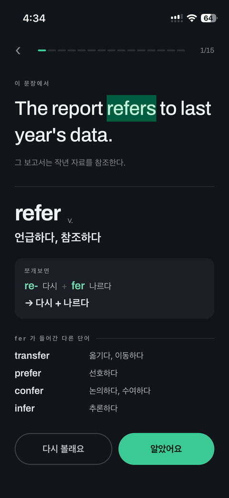
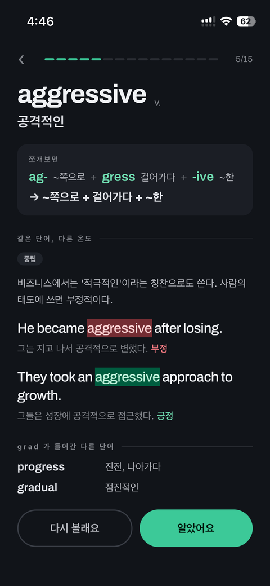
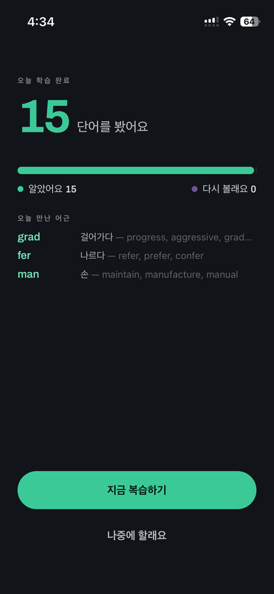

# Joshua

**어원과 뉘앙스로 배우는 영단어.** iPhone 전용, 무료, 광고 없음.

단어를 외우는 대신 읽어내는 법을 익히는 앱입니다.
영어 단어를 두 방향에서 가르칩니다 — 어떻게 만들어졌는지, 그리고 실제로 어떻게 쓰이는지.

---

## 어원 — 모르는 단어를 추론하는 힘

한자를 알면 처음 보는 한자어의 뜻을 짐작할 수 있듯이, 형태소를 알면 처음 보는 영어 단어의
방향을 짐작할 수 있습니다.

```
predict  =  pre- (미리)  +  dict (말하다)  →  미리 말하다  →  예측하다
```

`dict`를 한 번 익히면 dictionary, dictate, contradict가 함께 열립니다.
**외운 단어 수만큼 어휘력이 느는 것이 아니라, 어근 하나가 단어 여러 개를 데려옵니다.**

단어를 무작위로 모으지 않았습니다. 한 세션 안에서 같은 어근이 반복되도록 배열해,
두 번째 카드에서 이미 "아까 그 어근"이 옵니다.



---

## 뉘앙스 — 아는 단어를 틀리게 쓰지 않는 힘

사전적 뜻만 알면 문법은 맞는데 원어민은 쓰지 않는 문장을 만들게 됩니다.

> **smell** 은 '냄새가 나다'로 배우지만, 형용사 없이 그냥 쓰면 **안 좋은** 냄새를 뜻합니다.
>
> `This milk smells.` — 이 우유에서 상한 냄새가 난다
> `This soap smells nice.` — 이 비누는 좋은 냄새가 난다

한 끗 차이로 갈리는 두 문장을 나란히 보여줍니다. 설명보다 대조가 빠릅니다.

`aggressive`가 왜 사람에게는 비난이고 비즈니스에서는 칭찬인지, `reject`가 `decline`보다
왜 차갑게 들리는지 — 사전에 적히지 않는 정보를 함께 익힙니다.



**단, 억지로 붙이지 않습니다.** 특별한 함의가 없는 단어에는 이 영역이 나타나지 않습니다.
모든 단어에 "사실 이런 느낌이 있어요"를 붙이면 그건 학습이 아니라 소음입니다.

---

## 하루 15단어

5~10분이면 끝납니다. 뜻을 보기 전에 먼저 추측하고, 그다음 확인합니다.
모른다고 답한 단어만 복습 목록에 남습니다.

세션이 끝나면 오늘 만난 **어근**을 보여줍니다. 몇 단어를 봤는지가 아니라,
어떤 뿌리를 얻었는지가 이 앱이 말하는 성과입니다.



---

## 이런 앱입니다

- 계정이 없습니다. 가입하지 않아도 바로 시작합니다
- 인터넷 없이 완전히 동작합니다
- 광고가 없습니다
- 학습 기록은 기기 안에만 저장되며 어디로도 전송되지 않습니다
- **점수도 랭킹도 연속 학습일수도 없습니다.** 추론하는 습관을 기르는 것이 목적이지,
  매일 접속하게 만드는 것이 목적이 아니기 때문입니다

중급 이상 학습자를 위해 만들었습니다. 기초 단어는 어느 정도 갖췄고,
추상어와 학술 어휘로 넘어가려는 분에게 맞습니다.

---

## 문의

앱에 관한 문의, 버그 신고, 단어 데이터 오류 제보를 받습니다.
어원이나 뉘앙스 설명이 틀렸다고 생각되면 꼭 알려주세요.

**wjdalsckd45@gmail.com**

확인하는 대로 답장드립니다.

[개인정보처리방침](/Joshua/privacy/) · Joshua는 어떠한 개인정보도 수집하지 않습니다.

---

2026 Min Chang Jeong
